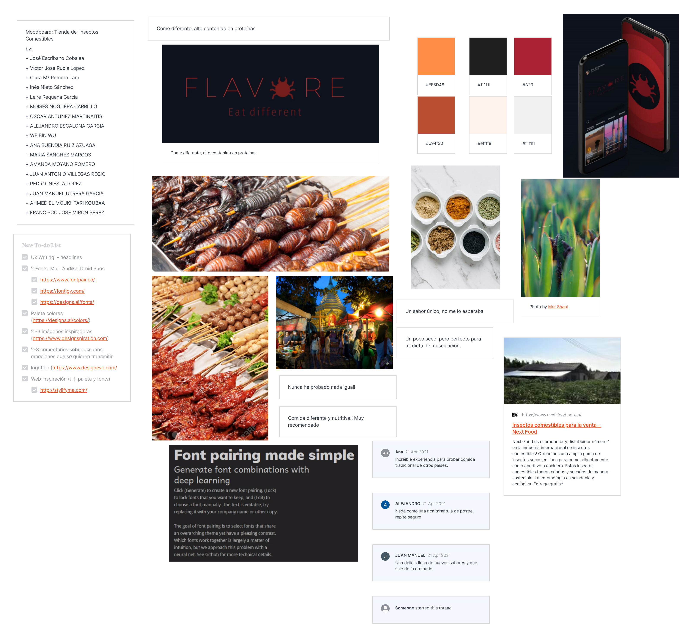
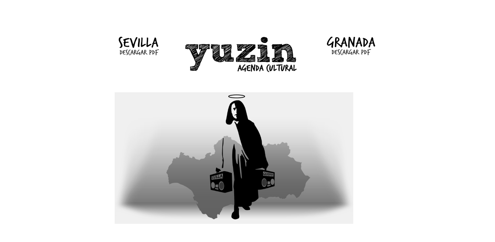
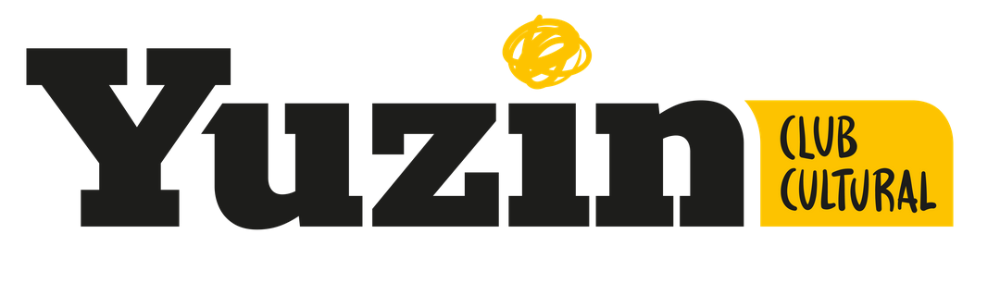
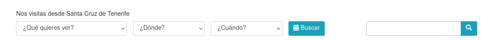
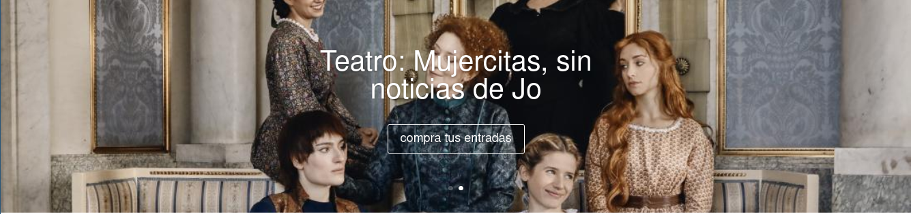
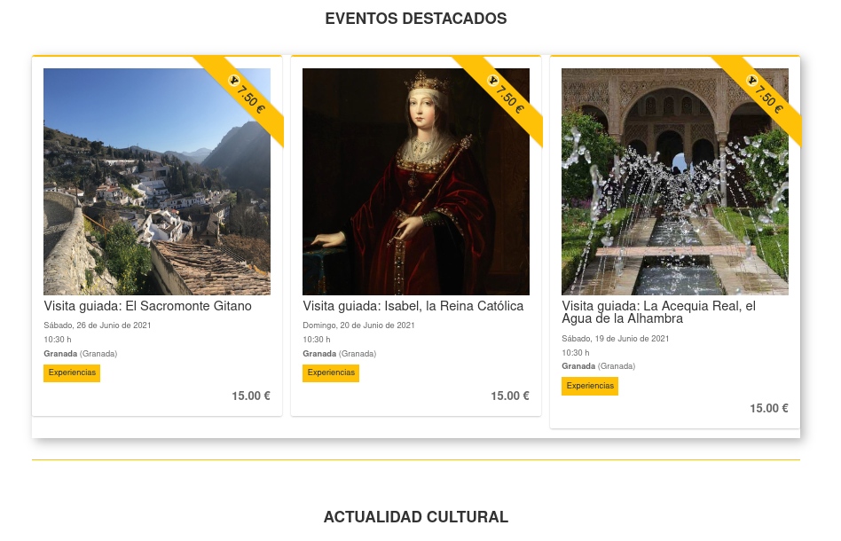
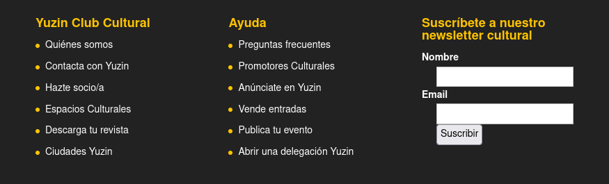

# DIU 20/21 - Trabajo final

###### Clara María Romero Lara

## Parte I - Mi experiencia UX

En esta asignatura hemos abarcado el diseño de usuario desde múltiples perspectivas - pero siempre centrándonos en el usuario, el ser humano detrás de la pantalla. 

Me han interesado particularmente los aspectos del factor humano (sobre todo los relacionados con la usabilidad y accesibilidad) y las metodologías de diseño y reglas doradas. Este segundo punto en particular me parece relevante, dado que en esta disciplina no se pueden ofrecer algoritmos exactos que nos lleven a un buen producto: solo se pueden aportar pautas que nos guíen en el desarrollo.

En una actividad de clase desarrollamos el moodboard e imagen de marca de *FLAVORE*, una tienda ficticia de insectos comestibles. En un tiempo muy limitado, siguiendo una serie de breves pautas, logramos desarrollar una marca, con su propio lenguaje visual y paleta de colores, que hacía que este negocio se mostrara como una experiencia radical, atractiva y exótica.

En el análisis de un problema desde un punto de vista externo y objetivo (etnografía), nos planteamos que, a veces, un diseño técnicamente correcto no resulta sencillo de utilizar a usuarios poco avanzados. Es importante saber qué achacar al diseño y qué al usuario, así como conocer bien al público objetivo de nuestro producto. Una de las partes más complejas es tratar de adoptar el papel de observador objetivo, y liberar de juicios nuestro análisis.

Pero las actividades teóricas que más me han aportado han sido las de usabilidad y accesibilidad: el planteamiento de que no todo el mundo se maneja igual, ya sea por distintas capacidades; o por cómo cada persona procesa y navega la información disponible de forma distinta. También el tener que considerar la accesibilidad de forma retrocompatible: no todo el mundo dispone de dispositivos modernos, o un buen internet para cargar todo el contenido CSS y JS. En esta era, en la que nuestras páginas web y aplicaciones cada vez dependen más de su estilización y *plug-ins*, es curioso comprobar cómo muchas páginas no aguantan ni son legibles cuando se quedan en el HTML puro. Aunque la estilización es un elemento extremadamente importante para el diseño, no podemos olvidarnos del esqueleto, del contenido. Durante el desarrollo de las actividades de clase pude comprobar como muchas páginas oficiales quedan absolutamente inutilizables sin los estilos.

Las prácticas de la asignatura dan un producto final de los más vistosos de la carrera: es curioso comprobar como, aunque no tenemos que implementar la aplicación, queda un producto realista. Pienso que esto se debe a que tenemos mentalidad de programadores, y al hecho de haber seguido *guidelines* de diseño basadas en *material design*.

Nuestra aplicación, *Intero*, se basaba en el concepto de economía colaborativa: una aplicación en la que viajeros alquilan habitaciones a particulares durante estancias cortas, para vivir el turismo de una forma diferente, no masificada, en destinos poco comunes. 

Algunos de los puntos de las prácticas que más he disfrutado trabajar han sido los siguientes:

- **El análisis competitivo de otras empresas**: como ya hemos comentado, una de las partes más difíciles de estos análisis es la objetividad. Pero en este caso, al contrario que en la actividad sobre etnografía, debemos ser mucho más críticos con la información que tenemos: cosas que, como usuario, dejaríamos estar aunque no nos parezcan óptimas, se vuelven malas calificaciones en el reporte de usabilidad. 

- **Moodboard**: en esta autoevaluación de la experiencia de la asignatura ya se han mostrado dos moodboards para hablar de proyectos enteros. En mi opinión, son una herramienta extremadamente útil en el desarrollo de un proyecto, sea del tipo que sea. Mostrar en un único lugar tanta información, tanto técnica como emocional e iconográfica, es una herramienta muy potente a la hora de transmitir, en esencia, lo que es nuestro proyecto.

- **Desarrollo de un prototipo hi-fi o mock-up**: esta ha sido mi primera vez desarrollando una aplicación móvil. Tras las prácticas anteriores, en las que desarrollamos un prototipo lo-fi, la matriz de tareas, el moodboard y la estética general... Poder crear algo tangible, interactivo, y ver cómo todos esos elementos previos forman un "todo" cohesivo es realmente satisfactorio y gratificante. 

- **Evaluación y user testing de otros proyectos**: una de las partes más interesantes de las prácticas. El estilo A-B-C testing nos obliga a emplear la misma vara de medir en tres proyectos muy distintos. 

  Fue extremadamente interesante y revelador tener entrevistas con usuarios externos a la asignatura sobre cómo percibían las tres aplicaciones, entre las que se encontraba nuestro proyecto, al que hemos dedicado tanto tiempo. Tanto las opiniones positivas como las negativas nos aportaron una percepción distinta, a la que opino que es imposible acceder cuando eres parte del desarrollo.

Fuera de la asignatura también ha habido oportunidades de aplicar conocimientos de DIU: en el desarrollo de otras prácticas de la rama relacionadas con diseño web, hemos aplicado pautas de estilo estudiadas aquí - uso de una paleta de colores cohesiva, leyes de proximidad, similitud... Que hacen de una página blanca e impersonal, un proyecto con una imagen de marca asociada. Uno de los proyectos fue un juego, de estética amigable y relajada; y otro una página de organización de eventos, siguiendo el estilo de diseño *Alegria*.

En definitiva, los contenidos de esta asignatura permiten la creación de proyectos cohesivos y atrayentes, que favorecen al uso humano de nuestras aplicaciones. En lo personal, pienso que mi experiencia UX se ha basado equitativamente en el uso de herramientas correctas, y sobre todo, en entender a las personas.

## Parte II - Caso de estudio: YUZIN

Esta parte se basa en analizar el rediseño de YUZIN, una revista cultural que recientemente ha decidido hacer un *rebranding* para abarcar, a parte de la revista, lo que han nombrado como *YUZIN club cultural*.

Para entender mejor el rediseño, vamos a analizar brevemente la versión anterior. Con [`the wayback machine - Internet Archive`](https://archive.org/web/) hemos accedido a una *snapshot* de Agosto de 2019.

Como hemos mencionado antes, esto no es únicamente un rediseño de la página web: es un *rebranding*, implica cambiar el propósito y la imagen de marca de *Yuzin*. Podemos ver que en la versión antigua las opciones de la página se limitan a descargar o bien la versión sevillana, o bien la versión granadina de la revista. Si vemos la versión actual, nos damos cuenta de que la revista queda relegada a un segundo plano, mientras que en la página principal se ofertan diversas secciones (artículos de opinión, actividades culturales...).

Esta es la página tal y como se presenta en mi ordenador, al abrirla sin modificar ningún aspecto. Vamos a recorrer la página en su enteridad y analizar todos los elementos que se nos presentan.

### Análisis de la página de inicio

#### Barra superior

Lo primero que me gustaría indicar es que el rediseño ha alcanzado el logo, lo cual me parece un acierto. En la versión previa, el logo era simplemente una estilización del nombre. Ahora cuenta con una imagen de marca y múltiples variaciones del logo para distintos usos. Esta es una buena práctica, que da pie a usar la versión más adecuada según el momento:

- En la *topbar* está el logo completo, *Yuzin club cultural*.

  Aunque no se muestra en página, el logo da espacio a jugar con él y eliminar la parte de "club cultural", lo cual permite la creación de un logo más reducido o incluso de usarlo como firma en caso de que la marca se expanda a más campos.

- En el *footer* nos encontramos con una versión comprimida del logo: el garabato sobre la "i" del logo inicial, se convierte en un fondo sobre el que se sustrae la "Y". Este logo reducido se emplea a lo largo de la página como floritura, y se presta a usarlo también como una posible app móvil.

  

La barra del menú presenta algunos fallos: tiene una única palabra abajo porque no cabe en mi pantalla (es decir, su diseño no es *responsive* para todas las resoluciones), y además el espaciado interno es inconsistente, ya que se pierde el espaciado con el bloque en la izquierda.

Esto se soluciona cuando ponemos el zoom al 90%, pero como hemos dicho, indica un problema subyaciente en cómo se calcula el tamaño de la barra respecto a la pantalla.

La barra de iconos se ve fuera de lugar, en parte por la Ley de la región común: aunque no comparten la barra amarilla del menú, es obvio que estos elementos se posicionan en la barra superior, junto con el logo y el menú: ¿por qué hacer esta distinción para estos tres iconos? 

También destacar la redundancia de contar con el teléfono de contacto fuera de la página "Contacta", o el hecho de que los iconos y el texto no están alineados a media altura.

#### Búsqueda

Lo primero, la ubicación: nos ubica en Santa Cruz de Tenerife. Incluso probando desde otros dispositivos, se mantiene incorrecto. Dado que este dato es hasta irrelevante, si da problemas, opino que simplemente podría eliminarse este elemento.

La búsqueda cuenta con filtros correctos (tipo, ubicación, fecha), pero destacamos que el botón tiene un icono incorrecto (un calendario en vez de una lupa). Esto puede deberse a que se ubica junto a otra barra de búsqueda, más genérica, lo cual a parte de ser redundante puede dar lugar a error. La segunda barra de búsqueda podría ubicarse en otro sitio o eliminarse.

#### Banner de noticias

El banner de noticias es un carrusel en el que circula la última opinión publicada y uno de los eventos. La opinión está plagada de fallos: la foto no está centrada, tiene una errata (OPNION) que denota además un mal uso de la base de datos subyaciente, el título no entra, la animación de *hover* es muy rápida y con colores muy chocantes... El evento siguiente no tiene tantos fallos, pero mantiene la animación en hover, la imagen es de baja calidad y el botón de compras es poco visible.

#### Opinión

Los artículos no se alinean correctamente con las fotos. De nuevo, es un problema de resolución. Por lo demás, están correctos, si bien pienso en calidad personal que la previsualización del texto es un poco larga.

#### Eventos destacados y actualidad cultural

Los eventos destacados se ubican en un contenedor sin ningún espaciado excepto en la parte inferior.

La sección actualidad cultural está, además, totalmente vacía.

#### Footer

La información y formato general es correcto, pero se beneficiaría de tabular la información inferior a los títulos de las secciones para dar una mejor idea de jerarquización. Además, el formulario no tiene un formato coherente con el resto de la página, lo que sugiere que se trata de un formulario predefinido en el *workframe* con el que se ha desarrollado la web.

### Crítica y análisis del rediseño

| Aspectos positivos del rediseño                             | Aspectos a mejorar                                          |
| ----------------------------------------------------------- | ----------------------------------------------------------- |
| Mejor imagen de marca, expandida y reconocible              | Alineación de los artículos                                 |
| Buena paleta de colores y buen uso (en general) de la misma | Consistencia en la iconografía                              |
| Buena estructura de la información                          | Corrección de erratas e inconsistencias en la base de datos |
| Variaciones del logo                                        | Evitar exceso de menús y barras                             |

#### Mockup

Los cambios han sido:

- Se ha hecho el logo más grande
- Se ha incluido en el menú el icono de acceder a la cuenta
- Se ha reformateado la búsqueda
- Eliminada ubicación y barra de búsqueda secundaria
- Reformateado banner de noticias
- Alineado artículos
- Acortado previsualización
- Leer más ahora es un botón
- Añadido borde superior en eventos
- Tabulado los elementos del footer

